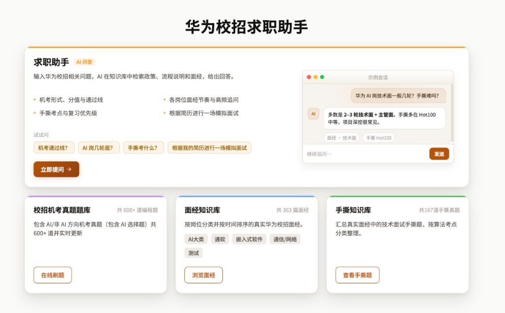
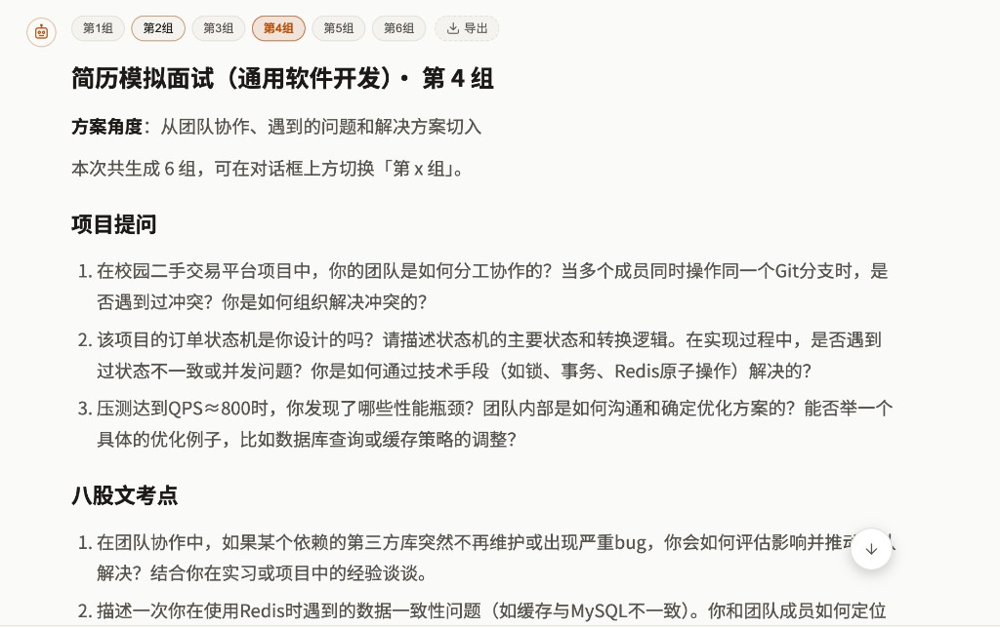
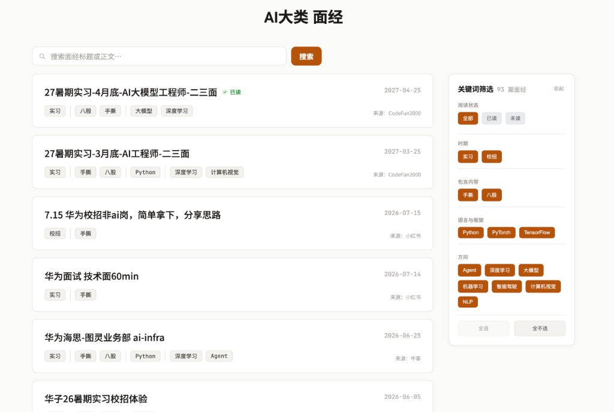
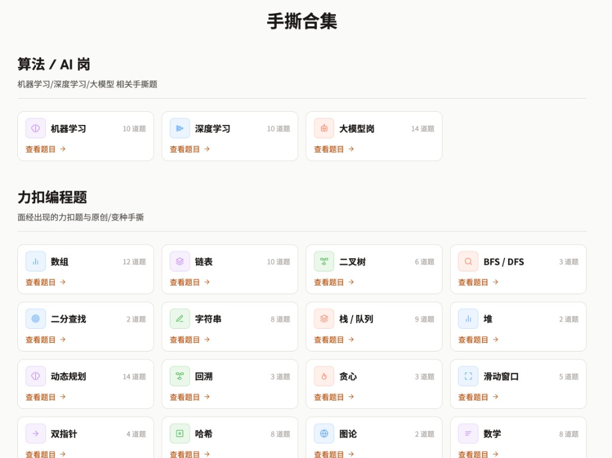

# 华为校招求职 Skills

在 Cursor、Claude Code、Codex 等支持 [Agent Skills](https://agentskills.io/specification) 的环境里，用两个命令搞定华为校招答疑与简历模拟面试——本地知识库随仓库分发，打开即用。

## 目标人群

面向投递**华为校招、计算机相关岗位**的同学，覆盖方向如下：

| 方向 | 常见岗位 |
|------|----------|
| **AI 大类** | AI 算法、AI 软开、AI 大模型、AI Agent |
| **通用软件** | 通软（通用软件开发） |
| **嵌入式软件** | 嵌软 |
| **测试** | 测试 / 测开 |
| **数据科学** | 数据科学相关方向 |

## 能解决什么问题

备战华为校招时，信息往往散落在官网、面经和题库里，查起来很费时，也容易把过期政策当成现行规则。

本技能包把常用流程、机考/测评要点、400篇真实面试经验与手撕题索引整理进本地知识库，让你在 IDE 里直接提问或按简历练面试，而不是到处翻帖。

| 能力 | 适合场景 |
|------|----------|
| **答疑**（`/hw-ask`） | 投递对象、机考规则、性格测评、双机位、面试流程、offer 相关疑问 |
| **模拟面试**（`/hw-interview`） | 贴上简历，生成项目追问、八股考点与一道手撕题，便于自练 |

## 关于作者

我是塔子哥。做华为校招求职相关内容已有 5 年，身边经校招进入华为的同学朋友不下百位；每年跟进校招流程，沉淀了大量一手经验，并做成校招求职指南与公开课，累计学习超过 50 万人次。现在将多年经验，结合网络上的400篇求职/面试帖，整理成「知识库 + Skills」开源出来，辅助各位备战华为校招求职。

## 安装

任选一种方式（**请用 `--all`**，两个 skill 都需要，且会一并带上各自目录内的知识库）：

```bash
# 从 GitHub 安装
npx skills add git@github.com:codefun2000/hw-skills.git --all -y

# 或从本地克隆目录安装
npx skills add ./huawei-campus-skills --all -y
```

安装成功后，技能列表中应出现 **`hw-ask`** 与 **`hw-interview`**。  
每个 skill 目录内都带有完整的 `knowledge/`，因此即使用 `npx skills add`（symlink 或 `--copy`）安装，答疑/模拟面试依赖的本地资料也不会丢失。

## 使用

### 答疑：`/hw-ask`

在对话里输入 `/hw-ask`，然后直接提问，例如：

- 华为机考现在怎么考？通过线怎么算？
- 性格测评是单机位还是双机位？有没有可靠的模拟练习？
- 软件开发岗技术面一般问什么？

助手会结合本地知识库作答，并标注依据来源（如站内资料、公开课片段；牛客/小红书面经作补充时不附外链）。

### 模拟面试：`/hw-interview`

输入 `/hw-interview`，粘贴简历正文（或附上简历文本），可选说明目标方向（如通用软件开发、AI、嵌入式等）。

你会得到一组可演练的内容，通常包括：

1. 针对简历项目的追问  
2. 贴合技能栈的八股考点  
3. 一道可点击跳转的手撕题与推荐理由  

可按需要再要 1～2 组换角度的变体。

## 更新知识库

我将长期维护该知识库，更新知识库的流程如下。已安装过的用户：

```bash
cd <你的 hw-skills 目录>
git pull --ff-only
```

或重新执行一次 `npx skills add … --all -y`。

## 仓库结构

```text
huawei-campus-skills/
├── README.md
├── knowledge -> skills/hw-ask/knowledge   # 兼容维护脚本的根符号链接
├── skills/
│   ├── hw-ask/
│   │   ├── SKILL.md
│   │   └── knowledge/                    # 权威知识库（随 npx 安装）
│   └── hw-interview/
│       ├── SKILL.md
│       └── knowledge/                    # 同步镜像（保证单独安装也完整）
└── schema/                               # 知识库分层说明（可选阅读）
```

## 可视化网页

同时我也将本Skills做成了网页版「华为校招求职助手」，适合不想折腾 IDE Skills、**想直接阅读面经/手撕真题**的同学：

- AI 问答 + 简历模拟面试  
- 机考真题题库、面经库、手撕题库可在站内浏览刷题  

网页地址：[codefun2000.com/hw](https://codefun2000.com/hw)

<table>
  <tr>
    <td align="center" width="50%">
      <br/>
      <sub>求职助手</sub>
    </td>
    <td align="center" width="50%">
      <br/>
      <sub>简历模拟面试</sub>
    </td>
  </tr>
  <tr>
    <td align="center" width="50%">
      <br/>
      <sub>面经知识库</sub>
    </td>
    <td align="center" width="50%">
      <br/>
      <sub>手撕真题知识库</sub>
    </td>
  </tr>
</table>

## 校招求职交流群

有更具体的问题想直接问我，或想和同学一起交流校招进度、面经与备考经验，可以加微信进群（备注「华为校招」）：

<p align="center">
  
</p>
